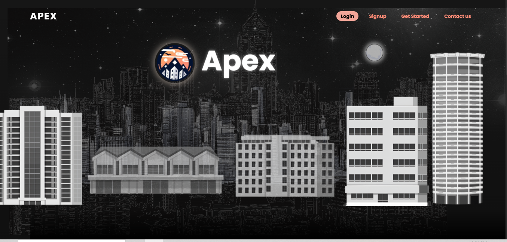
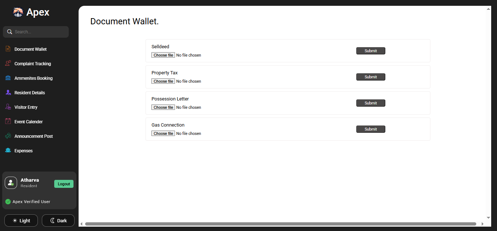

# 🏢 Apex – Society Management System

Apex is a responsive web-based society management platform built to streamline residential community operations. It simplifies resident and visitor management, automates billing, secures important documents, and provides real-time alerts for seamless administration.

---

## 🔍 Features

- 👥 **Resident Management** – Add, update, and manage resident details with role-based access.
- 💵 **Automated Billing** – Generate and track monthly maintenance bills.
- 🚪 **Visitor Tracking** – Log and monitor visitor entries for enhanced security.
- 🧾 **Document Vault** – Secure storage and access for society-related documents.
- 🔐 **Role-Based Access** – Admins, committee members, and residents have different access levels.
- 🔔 **Real-Time Alerts** – Notifications for important events and updates.
- 🎨 **Parallax UI** – Clean, modern user interface with parallax scrolling effects.
- 📱 **Responsive Design** – Works seamlessly on desktops, tablets, and mobile devices.

---

## 🛠️ Technologies Used

- **Frontend:** HTML, CSS, JavaScript  
- **Backend/Database:** Firebase Realtime Database, Firebase Cloud Storage  
- **Authentication:** Firebase Authentication  
- **UI Enhancements:** Parallax Scrolling, Responsive Web Design  
- **Deployment:** GitHub Pages / Firebase Hosting (Optional)

---

## 📸 Screenshots



---

## 🚀 Getting Started

### Prerequisites

- Basic knowledge of HTML, CSS, and JavaScript
- Firebase account

### Setup Instructions

1. Clone the repository  
   ```bash
   git clone https://github.com/AtharvaBagade23/apex-webdev-main.git
   cd apex-webdev-main

2. Set up Firebase Project

    Enable Authentication (Email/Password)

    Set up Realtime Database and Cloud Storage

    Replace Firebase config in firebase-config.js with your own project credentials.

3. Open index.html in browser or deploy via GitHub Pages/Firebase Hosting2

## 📂 Project Structure

.
├── .vscode/                 # VS Code settings (optional)
├── assets/                 # Static assets like fonts, icons, or videos
├── data/                   # Optional data files (JSON or others)
├── images/                 # Image files used in the UI
├── scripts/                # JavaScript files
├── stylesheets/            # CSS styles
├── contact.html            # Contact page
├── home-u.html             # Home page for user
├── index.html              # Landing page
├── login.html              # Login page
├── sign-up.html            # Sign-up selection or main registration page
├── sign-up-user.html       # Sign-up form for users
├── package.json            # Project metadata (for NPM or dependencies)
├── package-lock.json       # Dependency lock file
└── readme.md               # Project documentation

📌 Future Improvements
    Admin analytics dashboard

    Mobile app version using React Native

    Integration with payment gateways

    Push notifications using FCM

 Developed with Love ❤️